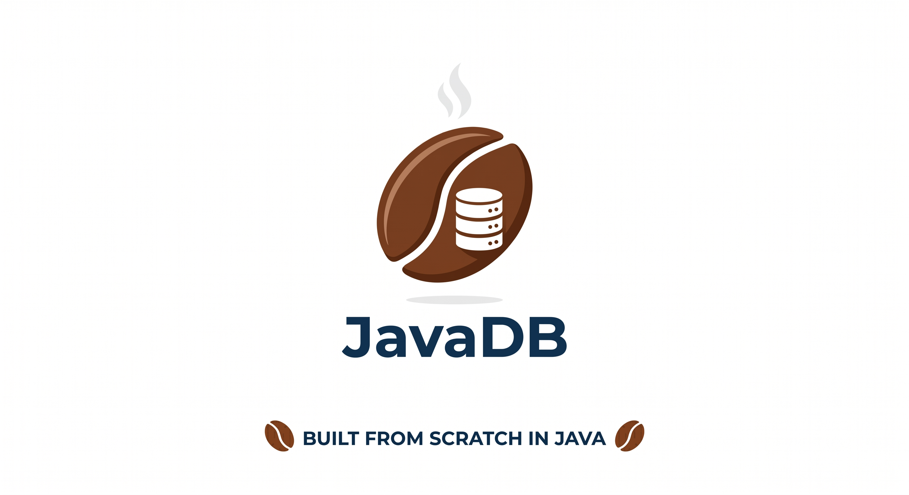

# javadb



A small relational database written from scratch in **Java 25**, with **no runtime dependencies**.

javadb parses a subset of SQL, stores typed rows in page-based files on disk through a buffer
pool, keeps a write-ahead log for durability, builds B+ tree indexes, and answers queries with
filters, joins and aggregation. A socket server accepts connections on virtual threads and a
line client speaks SQL to it.

The full architecture is described in [DESIGN.md](DESIGN.md).

## Highlights

- SQL subset: `CREATE TABLE`, `CREATE INDEX`, `INSERT`, `SELECT`, `UPDATE`, `DELETE`.
- Typed columns: `INT`, `LONG`, `DOUBLE`, `TEXT`, `BOOL`.
- Page-based storage with a buffer pool and least-recently-used eviction.
- Write-ahead log with crash recovery on startup.
- In-memory B+ tree indexes used for equality lookups.
- Query executor with `WHERE` filters, `INNER JOIN`, `GROUP BY` aggregation and `ORDER BY`.
- Virtual-thread connection handling and a matching interactive client.
- One global write lock per database keeps concurrent sessions safe.

## Requirements

- Java 25 (tested with Corretto 25).
- Maven 3.9+.

## Quick start

Build the runnable jar:

```bash
./release.sh
```

Start the server (port and data directory are optional, defaults shown):

```bash
./run.sh 6543 javadb-data
```

In another terminal, open the client (host and port are optional):

```bash
./client.sh localhost 6543
```

### Sample session

```
❯ ./client.sh
connected to javadb at localhost:6543
type SQL ending with ';'. type 'exit' to quit.
javadb> CREATE TABLE users (id INT, name TEXT, age INT);
CREATE TABLE users
javadb> INSERT INTO users VALUES (1, 'Alice', 30), (2, 'Bob', 25);
INSERT 2
javadb> select * from users;
id | name  | age
---+-------+----
1  | Alice | 30
2  | Bob   | 25
(2 rows)
javadb>
```

Keywords are case-insensitive. A statement may span several lines; the client sends it once a
line ends with `;`. Several `;`-separated statements can also be sent at once.

## SQL reference

### Data types

| Type     | Accepted aliases          |
|----------|---------------------------|
| `INT`    | `INTEGER`                 |
| `LONG`   | `BIGINT`                  |
| `DOUBLE` | `FLOAT`, `REAL`           |
| `TEXT`   | `VARCHAR`, `STRING`       |
| `BOOL`   | `BOOLEAN`                 |

String literals use single quotes; a doubled quote (`''`) is a literal quote. Line comments
start with `--`. `NULL`, `TRUE` and `FALSE` are recognised literals.

### Statements

```sql
CREATE TABLE users (id INT, name TEXT, age INT);

CREATE INDEX users_id ON users (id);

INSERT INTO users VALUES (1, 'Alice', 30);
INSERT INTO users (id, name) VALUES (2, 'Bob'), (3, 'Cara');

SELECT * FROM users;
SELECT name, age FROM users WHERE age >= 30 AND name <> 'Bob';
SELECT u.name, o.item
  FROM users u JOIN orders o ON u.id = o.uid
  ORDER BY o.item;
SELECT dept, COUNT(*), SUM(amount), AVG(amount)
  FROM sales GROUP BY dept ORDER BY dept;

UPDATE users SET age = age + 1 WHERE id = 2;

DELETE FROM users WHERE age < 18;
```

### Expressions

- Comparisons: `=`, `<>`, `!=`, `<`, `>`, `<=`, `>=`.
- Logic: `AND`, `OR`, `NOT`.
- Arithmetic: `+`, `-`, `*`, `/`.
- Aggregates: `COUNT`, `SUM`, `AVG`, `MIN`, `MAX`, including `COUNT(*)`.
- Qualified columns: `table.column` or `alias.column`.

When a single-table query has a `WHERE column = value` predicate and that column is indexed,
the B+ tree is probed instead of scanning the whole table.

## Architecture

The path of a statement, end to end:

```
SQL text
  -> Lexer            tokens
  -> Parser           sealed Statement / Expr tree
  -> Executor         pattern matching over the tree
       |- Catalog     table and index definitions
       |- Table       slotted heap pages
       |- BufferPool  off-heap page cache (Foreign Function & Memory API)
       |- DiskManager per-table heap files
       |- Wal         write-ahead log + recovery
       |- BPlusTree   equality indexes
  -> QueryResult      formatted rows
```

### Storage and durability

- The unit of storage is a 4096-byte **page**. Each table is a heap file of pages, and rows are
  packed into a slotted layout so they can be deleted in place. A record id `(pageNo, slot)`
  stays stable while a row lives, so indexes can point at rows.
- The **buffer pool** caches a bounded number of pages off the Java heap, allocated from a shared
  `Arena` as `MemorySegment`s, and evicts in least-recently-used order.
- The **write-ahead log** records full page images. A page image is logged and forced before the
  page reaches its data file. On startup the log is replayed onto the data files and then
  truncated; replaying page images in order is idempotent, so recovery is safe to repeat.
- Each write statement auto-commits: it flushes dirty pages, logs them write-ahead, and
  checkpoints the log.

### Java 25 features used

- **Records** model tuples, schema columns, tokens and AST nodes.
- **Sealed interfaces** describe the statement and expression trees and the value domain, so the
  executor handles every case exhaustively.
- **Pattern matching for `switch`** drives statement dispatch and expression evaluation.
- **Virtual threads** handle one client connection each.
- **Foreign Function & Memory API** holds page buffers off the Java heap.

## Project layout

```
com.javadb
  Main                       server bootstrap
  client.SqlClient           interactive SQL client over a socket
  server.DbServer, Session   accept loop on virtual threads, per-connection loop
  sql.Lexer, Token, Parser   SQL text -> tokens -> AST
  sql.ast.*                  sealed Statement and Expr trees plus clause records
  types.DataType, Value      column types and the sealed value domain
  types.Values               comparison, coercion and arithmetic over values
  catalog.*                  table and index definitions persisted to disk
  storage.*                  pages, disk I/O, buffer pool, write-ahead log
  engine.*                   row container, heap access, B+ tree, engine and executor
```

## Scripts

| Script        | Purpose                                                       |
|---------------|---------------------------------------------------------------|
| `release.sh`  | Run a clean build and produce `target/javadb.jar`.            |
| `run.sh`      | Package if needed, then start the server.                     |
| `client.sh`   | Package if needed, then start the interactive SQL client.     |

## Testing

```bash
mvn test
```

JUnit 5 tests cover the lexer, parser, value semantics, slotted page operations, the B+ tree,
write-ahead recovery, and end-to-end engine behavior including inserts, filters, joins,
aggregation, ordering, updates, deletes, indexed lookups and persistence across a reopen.

## Limitations

- No multi-statement transactions; each statement auto-commits.
- Joins are `INNER JOIN ... ON` only, evaluated with a nested loop.
- No cost-based optimizer; indexes are used through a single equality rule.
- Concurrency is serialized by one global write lock per database.

## License

See [LICENSE](LICENSE).
